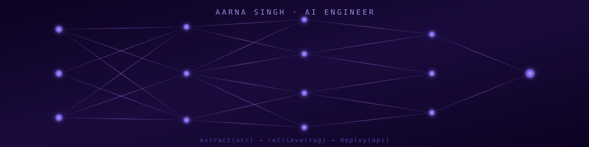

<p align="center">
  
</p>

<h1 align="center">⚡ Hi, I'm Aarna Singh</h1>
<h3 align="center">🤖 Python Developer | AI Engineer building LLM-powered systems that think, retrieve & respond</h3>

<p align="center">
  
</p>

<p align="center">
  <a href="https://linkedin.com/in/aarna-singh/"></a>
  <a href="mailto:aarnasingh812@gmail.com"></a>
  <a href="https://github.com/aarnasingh812"></a>
  
</p>

---

### 🧠 About Me

```python
class AIEngineer:
    def __init__(self):
        self.name = "Aarna Singh"
        self.role = "AI Engineer / Python Developer"
        self.focus = ["LLMs", "RAG Systems", "Conversational AI", "OCR", "Scalable Backends Architecture", "REST APIs"]

    def current_mission(self):
        return "Turning raw data + LLMs into reliable, production-ready AI systems 🚀"
```

- 🏢 Currently a **Python Developer** — building AI powered applications with Django REST Framework backends
- 💼 Previously **AI Engineer** — architected an LLM-powered chatbot that cut support response time by **40%**
- 🎓 B.Tech in **Computer Science (Specialization in AI & ML)**
- 🌱 Constantly experimenting on leveraging AI to solve real-world problems.

---

### 🛠️ Tech Stack

**Languages**
<p>
  
  
  
</p>

**Frameworks & Libraries**
<p>
  
  
  
  
  
  
  
  
</p>

**AI / ML**
<p>
  
  
  
  
</p>

**Data & Cloud**
<p>
  
  
  
  
  
</p>

**Tools**
<p>
  
  
  
  
</p>

---

### 📊 GitHub Stats

<p align="center">
  
  
</p>

<p align="center">
  
</p>

<p align="center">
  
</p>

---

### 📫 Connect with Me

<p align="left">
  <a href="https://linkedin.com/in/aarna-singh/" target="_blank">LinkedIn</a> •
  <a href="mailto:aarnasingh812@gmail.com">Email</a> •
  <a href="https://github.com/aarnasingh812">GitHub</a>
</p>

<p align="center"><i>🧠 "Turning tokens into insight, one inference at a time." — Thanks for stopping by, let's build something intelligent together!</i></p>